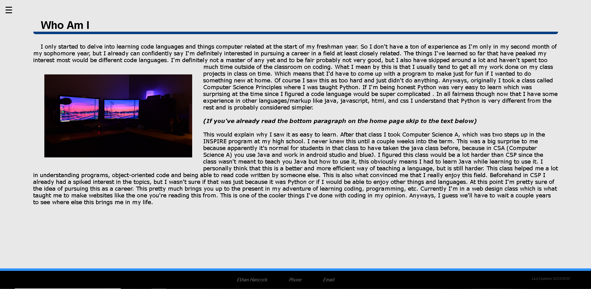

# finalProject
<h2>Contents</h2>

<ul>

  <li><a href="https://etrulz.github.io/finalProject/index.html">Home Page</a></li>
    <ul>
      <li>This page is just for navigation and only has links to the other pages. It also tells when the site was last updated</li>
      <li></li>
    </ul>

  <li><a href="https://etrulz.github.io/finalProject/about.html">About Page</a></li>
    <ul>
      <li>This page tells you about me and has as an image of me. It also tells a little of my story in programming and web development then
      links to the story page.</li>
      <li></li>
    </ul>

  <li><a href="https://etrulz.github.io/finalProject/works.html">Works Page</a></li>
    <ul>
      <li>This page shows you all my old websites embedded into the page.</li>
      <li></li>
    </ul>

  <li><a href="https://etrulz.github.io/finalProject/myStory.html">Story Page</a></li>
    <ul>
      <li>This page is a couple paragraphs about my story in coding and contains another image.</li>
      <li></li>
    </ul>

  <li><a href="https://etrulz.github.io/finalProject/interests.html">Interests Page</a></li>
    <ul>
      <li>This page lists my interests and what I'd like to do in the future.</li>
      <li></li>
    </ul>

  <li><a href="https://etrulz.github.io/finalProject/contact.html">Contact Page</a></li>
    <ul>
      <li>This page explains all my contact information and contains links to my email and phone number</li>
      <li></li>
    </ul>

</ul>

<a href="https://etrulz.github.io/finalProject/index.html">Link to the site</a>
